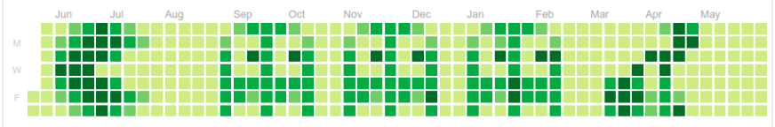

&nbsp;

### 👋 Welcome to my GitHub profile! I'm a Full Stack Developer from Moscow, specializing in Javascript, React and PHP development. 

- 💻 Currently I write in Javascript, Typescript, React + Redux. Looking for a job as Frontend engineer.
- ⚡ In my free time, I love exploring the latest tech articles and staying updated with emerging technologies and best practices.
- ✍️ I periodically solve algorithmic problems using [leetcode](https://leetcode.com/Vladislav_Z/), [codewars](https://www.codewars.com/users/le0pard) and [codeforce](https://codeforces.com/profile/ZobninVladislav_It-Team).
- 📫 How to reach me: .

### 🛠️ Languages and Tools:

  &nbsp;
  &nbsp;
  &nbsp;
  &nbsp;
  &nbsp;
  &nbsp;
  &nbsp;
  &nbsp;
  &nbsp;
  &nbsp;
  &nbsp;
  &nbsp;
  &nbsp;
  &nbsp;
  

### 🔥 My Stats:

 

<!--
**leopard-work/leopard-work** is a ✨ _special_ ✨ repository because its `README.md` (this file) appears on your GitHub profile.

Here are some ideas to get you started:

- 🔭 I’m currently working on ...
- 🌱 I’m currently learning ...
- 👯 I’m looking to collaborate on ...
- 🤔 I’m looking for help with ...
- 💬 Ask me about ...
- 📫 How to reach me: ...
- 😄 Pronouns: ...
- ⚡ Fun fact: ...
-->
